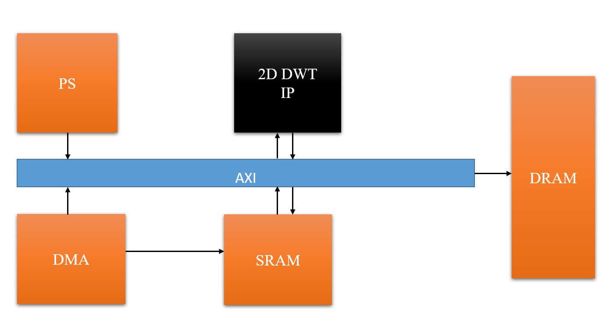
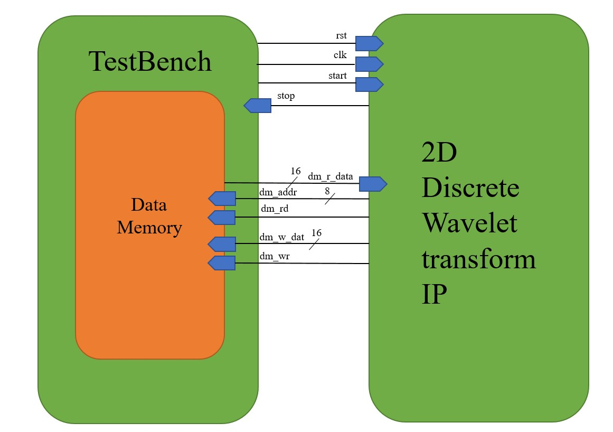
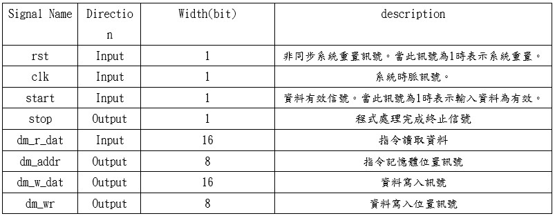

# <strong>
2D Discrete Wavelet transform design on ZYNQ
</strong>
## 
 SOC System On Chip Lab

## 
 Final Project Proposal

### 
Shun-Liang Yeh, NCHU Lab612

### 
5/2/2023

### 

# INDEX
1. [System Diagram](#i-system-diagram)
2. [System Specifications](#ii-system-specifications)
3. [References](#references)

# I. System Diagram
## Main system diagram

  

- I plan to design a 2D-DWT IP utilizing the Systolic array architecture  on to the ZYNQ board. The data flow would be controlled by the PS. Data extracted from DRAM using AXI DMA to On-Chip SRAM, later PS would send the data stream into the main IP block for signal processing. After processing the image, it would be write back to the DRAM.

# II. System Specifications

  

  

- The planned IP block before connecting to the AXI stream, I would first develop an 2D DWT IP block and test it using testbenches, later try to connect the I/O port onto the ZYNQ AXI interfaces.

### Goal
- Being able to successfuly connect the IP onto the AXI interface and run full system integration.
- Being able to run real-time DWT processing with minimum area, high speed and high hardware ultilization efficiency.
- Show the result onto onto VGA through the I/O interface of ZYNQ.

# III. References

[1] [T. C. Denk and K. K. Parhi, "Systolic VLSI architectures for 1-D discrete wavelet transforms," Conference Record of Thirty-Second Asilomar Conference on Signals, Systems and Computers (Cat. No.98CH36284), Pacific Grove, CA, USA, 1998, pp. 1220-1224 vol.2, doi: 10.1109/ACSSC.1998.751521.](https://ieeexplore.ieee.org/document/751521)

[2] [VLSI DIGITAL SIGNAL PROCESSING SYSTEMS DESIGN AND IMPLEMENTATION, CH7 Systolic Archtiecture design, exercises 14, Prof. Keshab Parhi, p219](https://www.amazon.com/VLSI-Digital-Signal-Processing-Systems/dp/0471241865)

[3] [ZYNQ Training Playlist for AXI stream, Mohammad S. Sadri, 2014](https://www.youtube.com/watch?v=0Dt8rWJdiJo&list=PLfYnEbg9Uqu5q6-XcfJkMN7O0P0dwJCn7)

[4] [Computer Architecture - Lecture 27: Systolic Arrays (ETH Zürich, Fall 2020), Prof. Onur Mutlu](https://www.youtube.com/watch?v=8zbh4gWGa7I&t=2161s)