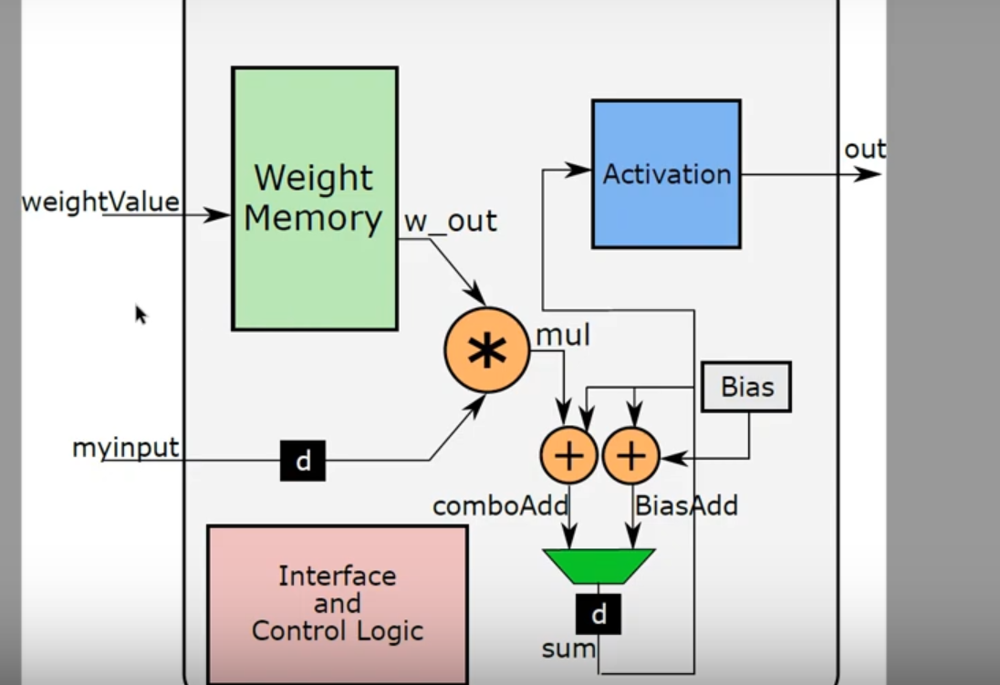

# Designing a Neural Network
1. Every Neurons in each layers is connected to every neurons in the another layer.

# IP
1. Usually we will not use Xilinx IP core directly, it makes the design not very flexible and portable.
2. Thus direct implementation is important.
3. Xilinx IP cores are also very efficient in building HW. Usually Block RAM is prefered.

# Coding style for IP block RAM distributed RAM instantiation
1. Following prefered coding style, Block RAM is used. If the output is in a sequential manner, block RAM is instantiated.
2. However, if you do combinational out, the distributed RAM is instantiated.

# Neuron

  

