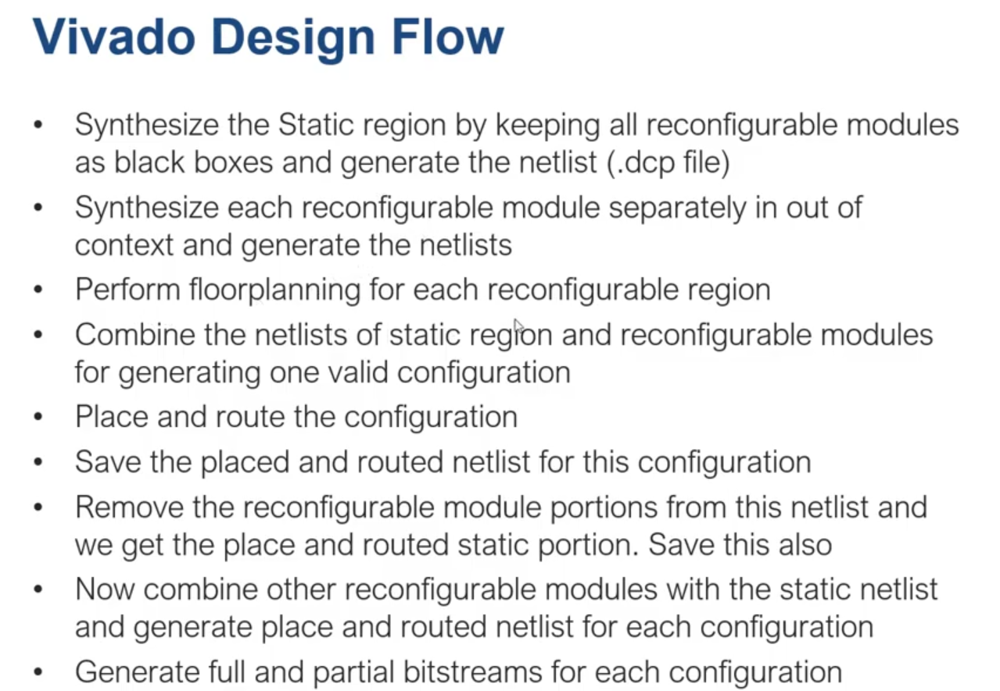

https://www.youtube.com/watch?v=eGB8-zHsCQg&list=PLXHMvqUANAFOviU0J8HSp0E91lLJInzX1&index=60
# Partial Reconfiguration
- Partial reconfiguration (PR) on FPGAs offers numerous advantages. It enables on-the-fly modifications, allowing new functionalities to be added or existing ones to be modified without disrupting the entire system. PR reduces downtime by selectively reconfiguring only the necessary portions, minimizing system interruptions. It optimizes resource utilization by dynamically allocating FPGA resources to different modules as needed. PR provides hardware flexibility, allowing for customization and adaptation to changing requirements. These advantages make PR useful in applications such as software-defined radio, network processing, and adaptive signal processing, enhancing system functionality, reducing downtime, improving resource utilization, and enabling hardware adaptability.

# Terminologies
1. We dont want to use all the modules within the system.
2. Partial reconfiguration uses partial reconfiuring instead of spatial reconfiguration multiplexing.
3. Speicfy an area where a region of FPGA can be configured in run-time. Reduce system Cost, and thus one fpga chip can be shared by multiple users.

## PR region
1. Area on the device reconfigured at runtime

## Static region
1. Portion of FPGA not reconfigured.

## Reconfigurable module
1. module targeted for runtime reconfiguration

## Modes
1. Mutually exclusive implementation of the module

## Configuration
1. Sets of co-existent modes that make up a functional processing chain.
2. One region can have different modes. Configuration is the combination of co-existent modes.

## Frame
1. 1 bit wide and 1 column. The smallest unit of configuration.

## Tile
1. Smallest unit of PR, region is always an integer multiple of columns.

# Floorplanning
1. We should increase the density we want it be intenseded.
2. The region should be rectangular and in whole tiles.
3. Want height be integer multiples of device row,
4. Any modification -> full reconfiguration of region.
5. Vivado gives partial bitstream to reconfigure only a small portion of your fpga.


# Vivado Design Flow
1. This is not entirely supported in GUI. Part tcl part GUI. Also one must have at least university program for Xilinx usage to ultilize this function.
<p align="center">
  
</p>


# Out of Context Synthesis
1. The program of buffers between modules. Buffers should not be inserted when stictching the block module of new module.
<p align="center">
  
</p>


# Partial reconfiguration of Image processing IP
1. Now we want to reconfigure only the convolution of my IP. No need to resynthesis the whole system!
2. If we have partial reconfiguration, we only need one ip block in vivado block design for multiple different IP configuration like I want Sobel, Gaussian, Canny etc...  This can greatly reduce the system area.


# Use command for the black box module you want to reconfigure
1. Want the block you want to modify to be a black box
```
//synthesis_translate_off
    your design
//synthesis_translate_on

```
2. Then add (*black_box)

# In design run
1. Out-of-Context module Runs exists, PR would syntehsis the entire system except the IP part.

# DCP file
1. The netlist of your file in synthesis.
2. Warning the black box is within the design after synthesis.


# Writing netlist
```
    write_checkpoint ./netlist/static/static.dcp
```

# Search for your configurable block in Netlist
1. Now we have to build modules for our IP.
2. Add modes onto this.

# For the desired reconfigrable mode
1. One must keep the same module name, smae I/O, but different logic. CONV module is our reconfigurable module.
2. We have to generate the netlist for all our desired block.

# Synthesis but remember the out of context porlbme
```
    synth_design -mode out_of_context -top conv
```
- Running in TCL command, .dcp would not be saved, must explicitly saved it
```
    write_checkpoint ./netlist/blur/conv.dcp
```
- Note the name must be the same.

- DO all these steps for the IP you want to reconfigure.


# Floorplanning
1. From the netlist of your black box, DRAw fabric from Floorplanning.
2. Check whether the region you select is within a single clock region.
3. You can see the resources circled by your action.
4. In Block properties, REST AFTER RECONFIGURATION. SNAPPING_MODE must be turn ON.
5. Remember that the thing you have done when designing becomes a part of tcl file. Just save it and for later re-execution.


## Stitching the design onto the Region
- Must give the entire hierachy of the cell.
```
    read_checkpoint -cell [get_cells system_i/imageProcess_0/inst/conv] ./netlists/sobel/conv.dcp
```

## Tell vivado This is a PR system
1. Go property, Add property.
2. Find HD.RECONFIGURABLE and check it. Explicitly check the option.


# Place and route
1. First saving this configuration
```
    write_checkpoint ./netlists/config1/config1.dcp
```
2. Command line for P&R
```
    opt_design
    place_design
    route_design
```
3. Saving the netlist
```
    write_checkpoint ./netlists/config1/configrouted.dcp
```

# Static region remains, removes portion of reconfigured region
1. Tell the design you want to remove
```
    update_design -cell [get_cells system_i/imagePorcess_0/inst/conv ./netlists/soble/conv.dcp] -black_box
```
2. Then we must save this place and routed region, we want to preserved the static region through command, always preserve the static region
```
    lock_design -level routing
```
3. Write netlist also
```
    write_checkpoint ./netlists/static/staticRouted.dcp
```

# Reading next mode of module
1. Read another design's Netlist
```
    read_checkpoint -cell [get_cells system_i/imageProcess_0/inst/conv] ./netlists/sharpen/conv.dcp
```
2. Then remember to place and route, then save the design
```
    write_checkpoint ./netlists/config2/configrouted.dcp
```
3. Then update the design of black box again
```
    update_design -cell [get_cells system_i/imagePorcess_0/inst/conv ./netlists/soble/conv.dcp] -black_box
```
........


# Eventually generate the Final bitstream
1. The name of the full system, we have partial bitstream and full bitstream.
```
    write_bitstream ./bitstream/config3/config3.bit
```

2. Open checkpoint
```
    open_checkpoint ./netlists/config1/config1_output.dcp
```

1. These things can be done easily through command line.

##